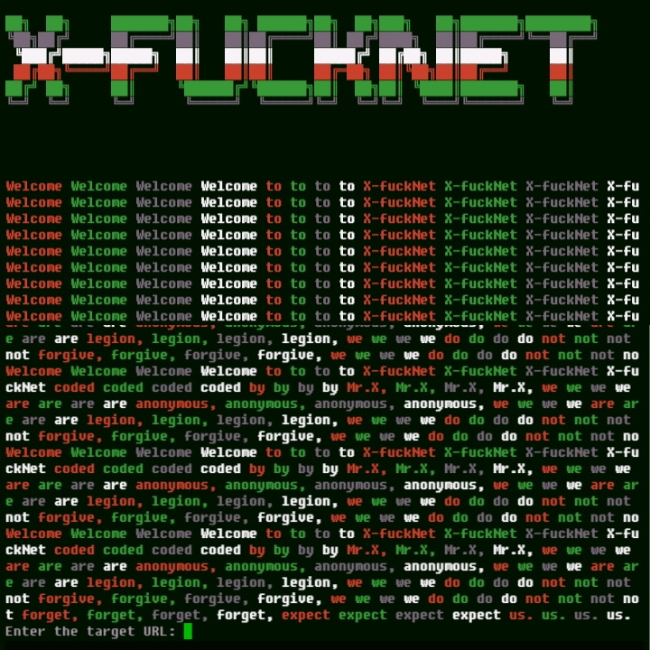

# X-fucknet 


## introduction
X-fucknet is the best tool with full power to carry out DDOS ​​attacks {Distributed Denial of Service}

## Instalations
```
$ pkg update && pkg upgrade
$ pkg install python
$ pkg install python3
$ pkg install git
$ git clone https://github.com/Whomrx666/X-fucknet.git
$ cd X-fucknet 
$ python3 X-fucknet.py
```

## Instructions
- **First**: Install the tools above according to the instructions above
- **Second**: After installing, enter the target URL into the URL column
- **Last**: Tools will carry out a ddos ​​attack on the target you are aiming for until it goes down

## Observation
This is a tool for education only, I am not responsible for any misuse
### Original Author
<a href="https://github.com/Whomrx666"></a>

### <<< If you copy , Then Give me The Credits >>>

## CONNECT WITH ME :

[](https://whomrxhackers.blogspot.com/)
[](https://twitter.com/whomrx666)
[](https://wa.me/6285926601133?text=Halo%2C%20Mr.X)
[](https://www.facebook.com/whomrx.666)
[](https://t.me/Whomr_X)
[](mailto:whomrx666@gmail.com)
[](https://www.tiktok.com/@whomr.x)

**If you want to donate, click on the button**
<a href="https://saweria.co/whomrx"></a>

---

<p align="left">
  
</p>

---

<h2>Good luck doing ddos</h2>
